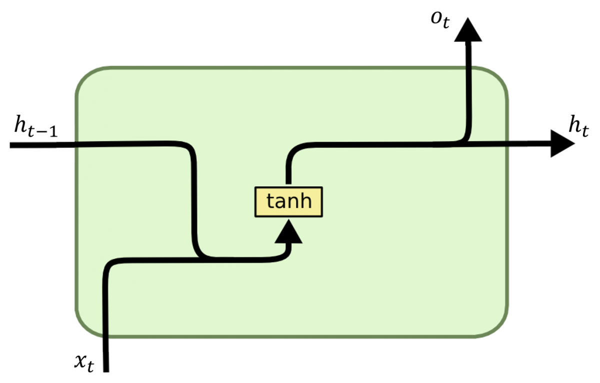
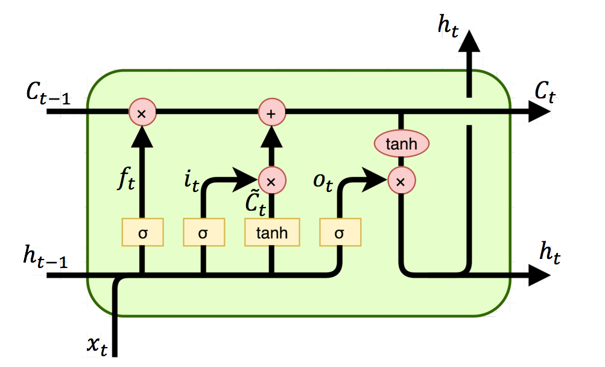
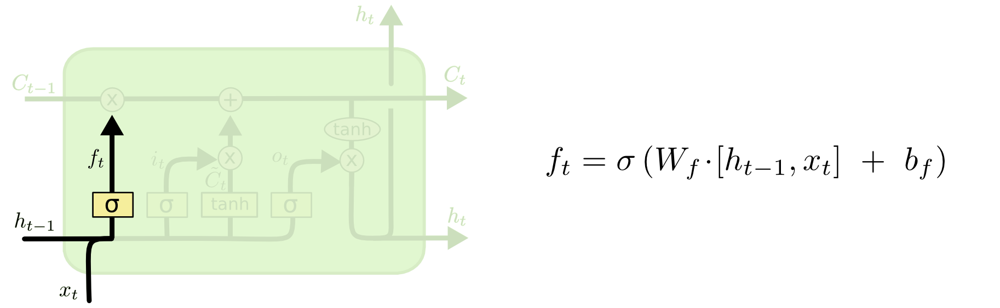
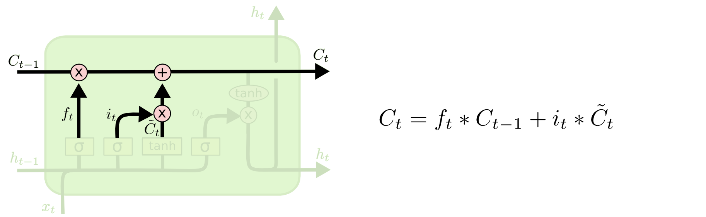
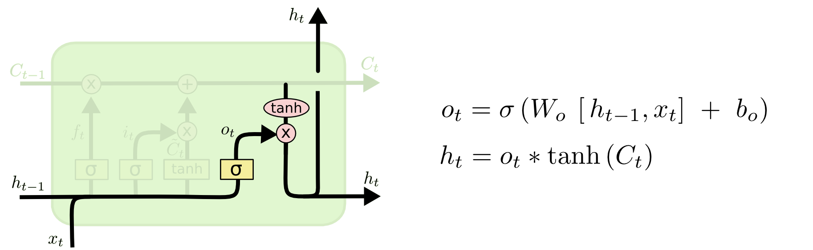

# RNN(SRNN)
## 原理
在NLP领域，RNN的重要性无须多言，在自监督模型风靡之前，NLP领域的任务基本上都被RNNs长期霸榜。

RNN的核心其实极其简单：
>把线性层循环起来，前一刻的输出作为下一刻的输入。

这样序列上每个时间点上的特征也就被依次串了起来，下一刻的序列内容可以看到之前所有的状态。同时为了序列中的token可以同时看到前后的信息，也就诞生了bi-RNNs，但是思路是一样的，只不过将序列倒序排列而已。

RNN的隐状态计算公式为：

$h_{t}=tanh(w_{ih}\times x_{t}+b_{ih}+w_{hh}\times h_{t-1}+b_{hh})$



通俗来说也就是：
>序列的每个时刻，分别对上一步的输出和当前时刻的输入分别进行线性变换，并将它们的和用tanh进行激活。

在3这个时刻，RNN看起来就是：
$h_{3}(h_{2}(h_{1}(h_{0},x1),x_{2}),x_{3})$

很容易看到RNN的几个问题：
- 无法看到长距离的依赖，因为序列太长的话，经过了很多次嵌套，影响程度会越来越小。
- 梯度消失，tanh很容易梯度消失，尤其是多个tanh叠加。（其实Relu也没办法解决梯度在长距离传递上的问题）

## 代码
看一下pytorch中的RNN实现，在pytorch中RNN被用闭包层层封装了起来，为了方便说明原理，只挑选核心代码出来解析。

```python
def Recurrent(inner, reverse=False):
    def forward(input, hidden, weight):
        output = []
        steps = range(input.size(0) - 1, -1, -1) if reverse else range(input.size(0)) # steps=[seq_len-1, ...,1,0] or [0,1,...,seq_len-1]
        for i in steps:
            hidden = inner(input[i], hidden, *weight)
            # hack to handle LSTM
            output.append(hidden[0] if isinstance(hidden, tuple) else hidden)

        if reverse:
            output.reverse()
        output = torch.cat(output, 0).view(input.size(0), *output[0].size())

        return hidden, output

    return forward
```

可以看到非常清晰，会正向或者反向遍历整个序列，依次调用inner方法，将当前的输入input[i]和上一步的输出hidden传入。inner方法就是使用上文的隐状态公式进行计算，代码为：

```python
NNReLUCell(input, hidden, w_ih, w_hh, b_ih=None, b_hh=None):
    hy = F.relu(F.linear(input, w_ih, b_ih) + F.linear(hidden, w_hh, b_hh))
    return hy

def RNNTanhCell(input, hidden, w_ih, w_hh, b_ih=None, b_hh=None):
    hy = F.tanh(F.linear(input, w_ih, b_ih) + F.linear(hidden, w_hh, b_hh))
    return hy
```

# LSTM
## 原理


RNN很好理解，因为它直来直去，结构简单，上一步的输出直接传到下一步里面，没有各种弯弯绕。

LSTM就稍微复杂一点，看上图结构，如果对LSTM没有研究过，光看图很难理解到LSTM的核心。

>LSTM的核心是，它比RNN多了一条主线，那就是C，通过“门”结构，对当前的输入$x_{t}$和上一步的输出$h_{t-1}$进行加权，使得该记住的被记住，该遗忘的被遗忘，该输出的被输出。

有哪些门？
- 遗忘门，控制旧知识($h_{t-1}$)融入C，即控制哪些旧知识可以进入主线，哪些不能进入主线
- 输入门，控制新知识($x_{t}$)进入主线，即控制哪些新知识可以进入主线，哪些不能进入主线。
- 输出门，控制输出。即控制输出什么信息。

到底什么是门？门这个概念确实有点难以理解。门其实很像电路中的开关，开的话就是1，表示电流可以通过，关的话表示0，表示电流没办法通过。

思考一下，在神经网络里面什么东西最像是一个门呢？其实不难想到，sigmoid！
>sigmoid像是一个soft gate，它输出的不是0或者1，而是一个0-1的数，表示通过程度，或者拒绝程度。

理解了这一点，其实LSTM就理解了一多半。

## 遗忘门--有选择的忘记信息



可以看到，将$h_{t-1}$和$x_{t}$进行线性变换之后，用sigmoid进行激活，得到遗忘门的输出。

为什么这个概率就是遗忘概率呢？参数更新的时候会说，是因为这个概率会和$C_{t-1}$相乘。表示上一个时刻C保留下来的程度。

## 输入门--有选择的决定当前信息保留程度


可以看到输入门稍微复杂一点，有两个步骤，但是理解了遗忘门之后，输入门的思路也非常清晰。

>先用sigmoid得到一个概率，然后和当前的输入（x和h）相乘，表示当前输入的保留程度

需要注意的是，当前输入是要经过线性变换之后才和概率相乘的，所以有两个步骤
1. 输入通过线性变换
2. 线性变换之后的输入，和概率相乘

## 参数更新


参数更新的是C上的参数，C上的参数，随着主线和h一样同时传入下一个神经元。

1. $C_{t-1}$和遗忘门的概率相乘，表示上一个时刻留下了的数据
2. 输入门的概率和输入（经过线性变换）相乘
3. 1和2的结果相加，作为新的C传入下一个神经元

## 输出门



同样的，概率是用h和x进行计算的，但是需要注意的是，输出门是概率和C的相乘。

