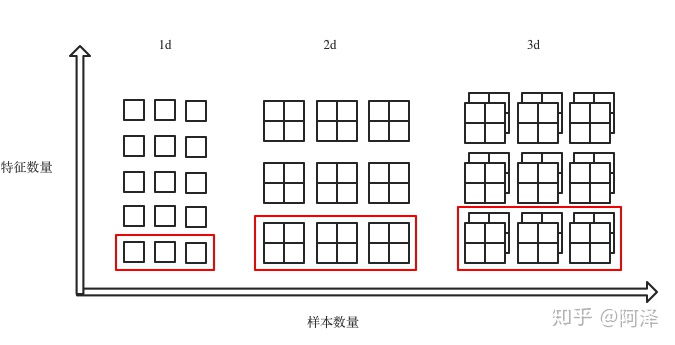

数据规范化是机器学习中非常有效的一种手段。
在深度学习中的Batch Normalization（BN），LN，GN等数据规范化方法已被广泛使用和证明有效性。

# Normalization
## min-max normalization
$x'=\frac{x-min(x)}{max(x)-min(x)}$

## Mean normalization
$x'=\frac{x-average(x)}{max(x)-min(x)}$

## Standardization (Z-score Normalization)
$x'=\frac{x-\hat{x}}{\sigma}$

本文介绍的主角就是Standardization，也就是标准化。
在深度学习中，按照规范化的对象不同，可以分为两类：
1. 对激活后的输出值进行标准化。如BN（Batch Normalization），LN（Layer Normalization），GN（Group Normalization），IN（Instance Normalization）
2. 对神经元连接边的权重进行标准化。如WN（Weight Normalization）

# Batch Normalization
BN看名字，也就是批标准化。由名字我们基本上知道他的处理逻辑。

在深度学习中，Batch也就是mini-batch了。也就是说，对mini-batch进行标准化。

>BN的核心是**使得每一层的神经网络的输入保持相同的分布**

## Algorithm
对于给定d维的输入$x=(x^{(1)},...x^{(d)})$

BN会对每一个维度都进行规范化:
$\hat{x}^{(k)}=\frac{\hat{x}^{(k)}-E[\hat{x}^{(k)}]}{\sigma(\hat{x}^{(k)})}$

通俗的来说，也就是：
>对于mini-batch中的d维，依次进行规范化，也即是对特征的规范化（区别于LN）

## BN1d/BN2d/BN3d
BN1d/BN2d/BN3d的区别在于特征的维度。对于一个样本，它的维度为：
$batch\_size*feature\_size*feature\_dim$

例如：
1. 线性层的输出，往往是feature_dim=1。
2. RNN的输出，feature_dim=2。

所以三者的输入为：
1. BatchNorm1d：输入输出 shape 为（N, C）或则（N, C, L）；
2. BatchNorm2d：输入输出 shape 为（N, C，H, W）；
3. BatchNorm3d：输入输出 shape 为（N, C，D, H, W）。

用图片来展示三者的区别，也就是：

红框里面也就是BN进行标准化的对象。

