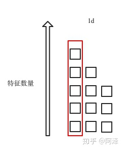
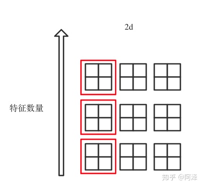
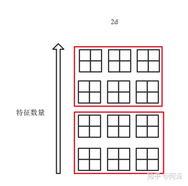

数据规范化是机器学习中非常有效的一种手段。
在深度学习中的Batch Normalization（BN），LN，GN等数据规范化方法已被广泛使用和证明有效性。

# Normalization
## min-max normalization
$x'=\frac{x-min(x)}{max(x)-min(x)}$

## Mean normalization
$x'=\frac{x-average(x)}{max(x)-min(x)}$

## Standardization (Z-score Normalization)
$x'=\frac{x-\hat{x}}{\sigma}$

本文介绍的主角就是Standardization，也就是标准化。
在深度学习中，按照规范化的对象不同，可以分为两类：
1. 对激活后的输出值进行标准化。如BN（Batch Normalization），LN（Layer Normalization），GN（Group Normalization），IN（Instance Normalization）
2. 对神经元连接边的权重进行标准化。如WN（Weight Normalization）

# Batch Normalization
BN看名字，也就是批标准化。由名字我们基本上知道他的处理逻辑。

在深度学习中，Batch也就是mini-batch了。也就是说，对mini-batch进行标准化。

>BN的核心是**使得每一层的神经网络的输入保持相同的分布**

## Algorithm
对于给定d维的输入$x=(x^{(1)},...x^{(d)})$

BN会对每一个维度都进行规范化:
$\hat{x}^{(k)}=\frac{\hat{x}^{(k)}-E[\hat{x}^{(k)}]}{\sigma(\hat{x}^{(k)})}$

通俗的来说，也就是：
>对于mini-batch中的d维，依次进行规范化，也即是对特征的规范化（区别于LN）

## BN1d/BN2d/BN3d
BN1d/BN2d/BN3d的区别在于特征的维度。对于一个样本，它的维度为：
$batch\_size*feature\_size*feature\_dim$

例如：
1. 线性层的输出，往往是feature_dim=1。
2. RNN的输出，feature_dim=2。

所以三者的输入为：
1. BatchNorm1d：输入输出 shape 为（N, C）或则（N, C, L）；
2. BatchNorm2d：输入输出 shape 为（N, C，H, W）；
3. BatchNorm3d：输入输出 shape 为（N, C，D, H, W）。

用图片来展示三者的区别，也就是：

红框里面也就是BN进行标准化的对象。

## 训练和测试的差别
我们可以看到BN在每一层计算均值和方差都是基于当前batch中的数据的。所以当batch比较大的时候会比较稳定。

但是就带来了一个问题，我们在测试的阶段，往往都只有一个样本或者较少的样本，此时，样本均值和方差一定是有偏的估计，这应该怎么办呢？

其实很好想到办法，
>将训练阶段的均值和方差存下来，在测试阶段用这个统计量进行标准化。

在实际过程中，我们肯定不会把训练过程中每次的BN结果都存下来。
1. 把每次结果都存下来很占空间。
2. 最开始train的过程都还没开始收敛，也没啥用。

所以一般会引入momentum参数(记做m)，不断衰减历史的均值和方差的影响

$$runningmean_{i}=(1-m)\times runningmean_{i-1}+m\times mean_{i} $$ 
$$runningvar_{i}=(1-m)\times runningvar_{i-1}+m\times var_{i}$$

## Layer Normalization
Layer Normalization 看名字容易搞迷糊，其实要单看Layer这个词，确实不好理解。

但是和BN比较一下，就会发现非常清晰。

试想一个问题：
>BN是对特征进行标准化，但是如果一个batch里面的样本的特征数不一致该怎么办呢？

对于CNN，DNN之类的网络，我们的input维度必须是一致的。

但是对于RNN，我们input的维度不必是一致的（当然也可以用padding和截断做成一致的）。但是，不同长度的序列只不过经过RNN的次数不同，RNN的输出维度是可以确定的，所以RNN的输入维度其实是可以不一样的。

这时候用BN就不合适了。

>那我们对样本进行标准化不就行了？对，这就是LN！

上图红框就是LN的标准化对象，可以看到和BN相反。

LN比BN要简单的多，不需要额外记录mean和var，因为每个样本都是根据自身特征进行的标准化。

## Instance Normalization
主要应用在CV领域(图片风格迁移)，通俗来说就是
>每个样本的每个channel都标准化一次（图片每个channel都有很多数据）

看到上图就都明白了，IN比LN和BN计算标准化的次数要更多。
>如果说BN是按行标准化，LN是按列标准化，IN是按网格标准化

## Group Normalization
是对BN的一个改进，主要解决小batch的情况下，BN计算不准的问题。

思路就是：
>如果batch太小，那我们就多个channel一块进行标准化，数据不够，通道来凑。

毫无疑问，使用该方法，我们需要制定多少个channel一块进行标准化。

